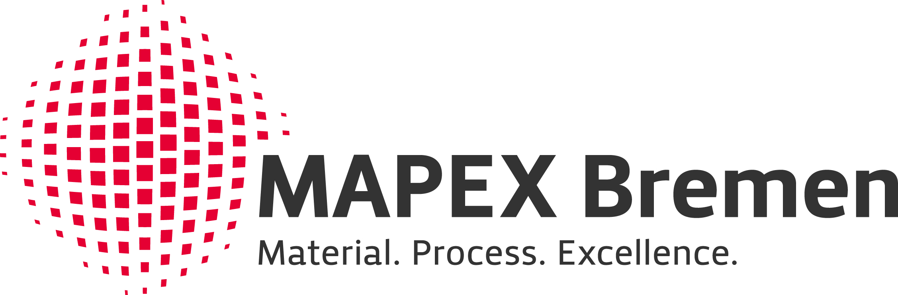

---
myst:
  substitutions:
    README.md of the repository: '`README.md` of the repository'
    aiida-core documentation: '`aiida-core` documentation'
    aiida-vibroscopy: '`aiida-vibroscopy`'
    mapex: '[MAPEX](https://www.uni-bremen.de/en/mapex)'
    ubremen_exc: '[U Bremen Excellence Chair](https://www.uni-bremen.de/u-bremen-excellence-chairs)'
    esg: "[Excellence Strategy of Germany\u2019s federal and state governments](https://www.dfg.de/en/research_funding/excellence_strategy/index.html)"
---

```{toctree}
:hidden: true

installation/index
tutorials/index
commands
```

```{toctree}
:hidden: true
:caption: How-to guides

howto/index
citeus
```

```{toctree}
:hidden: true
:caption: Topic guides

topics/workflows/index
topics/formulation
topics/overrides
topics/conventions
```

```{toctree}
:hidden: true
:caption: Reference

reference/api/index
```

# AiiDA Vibroscopy

An AiiDA plugin package for the calculation of __infrared__ and __Raman__ spectra and __harmonic phonons__ using [Quantum ESPRESSO](http://www.quantumespresso.org) and [Phonopy](https://phonopy.github.io/phonopy/). Compute ab-initio vibrational properties in automated fashion and with the use of any functional (and pseudo-potential formalism as well!), such as traditional LDA and GGAs, extended Hubbard functionals, hybrids and more!

[](https://badge.fury.io/py/aiida-vibroscopy)
[](https://pypi.python.org/pypi/aiida-vibroscopy)
[](https://github.com/bastonero/aiida-vibroscopy/actions)
[](http://aiida-vibroscopy.readthedocs.io/)

:::{versionadded} 1.2.0
* New **command line interface** to submit workflows! 🎮
* New post-processing calculation to compute **Pockels tensor**! Check out the [new tutorial](6_pockels.ipynb) 🚀
:::

______________________________________________________________________


::::{grid} 1 2 2 2
:gutter: 3

:::{grid-item-card} {fa}`rocket;mr-1` Get started
:text-align: center
:shadow: md

Instructions to install, configure and setup the plugin package.

+++

```{button-ref} installation/index
:ref-type: doc
:click-parent:
:expand:
:color: primary
:outline:

To the installation guides
```
:::

:::{grid-item-card} {fa}`info-circle;mr-1` Tutorials
:text-align: center
:shadow: md

Easy examples to take the first steps with the plugin package.

+++

```{button-ref} tutorials/index
:ref-type: doc
:click-parent:
:expand:
:color: primary
:outline:

To the tutorials
```
:::

::::

(cite)=

# How to cite

If you use this plugin for your research, please cite the following works:

> Lorenzo Bastonero and Nicola Marzari, [*Automated all-functionals infrared and Raman spectra*](https://doi.org/10.1038/s41524-024-01236-3), npj Computational Materials **10**, 55 (2024)

> Sebastiaan. P. Huber _et al._, [*AiiDA 1.0, a scalable computational infrastructure for automated reproducible workflows and data provenance*](https://doi.org/10.1038/s41597-020-00638-4), Scientific Data **7**, 300 (2020)

> Martin Uhrin, Sebastiaan. P. Huber, Jusong Yu, Nicola Marzari, and Giovanni Pizzi, [*Workflows in AiiDA: Engineering a high-throughput, event-based engine for robust and modular computational workflows*](https://doi.org/10.1016/j.commatsci.2020.110086), Computational Materials Science **187**, 110086 (2021)

Please, also cite the underlying Quantum ESPRESSO and Phonopy codes references.

# Acknowledgements

We acknowledge support from:

:::{list-table}
:widths: 60 40
:class: logo-table
:header-rows: 0

* - The {{ ubremen_exc }} program funded within the scope of the {{ esg }}.
  - 
* - The {{ mapex }} Center for Materials and Processes.
  - 

:::

[aiida]: http://aiida.net
[aiida quantum espresso tutorial]: https://aiida-tutorials.readthedocs.io/en/tutorial-qe-short/
[aiida-core documentation]: https://aiida.readthedocs.io/projects/aiida-core/en/latest/intro/get_started.html
[aiida-vibroscopy]: https://github.com/bastonero/aiida-vibroscopy
[aiidalab demo cluster]: https://aiidalab-demo.materialscloud.org/
[quantum espresso]: http://www.quantumespresso.org
[quantum mobile]: https://quantum-mobile.readthedocs.io/en/latest/index.html
