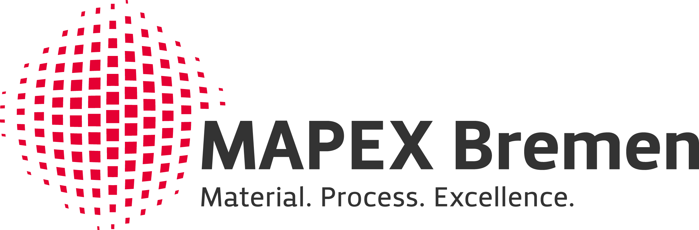

############################################
Automated Vibrational Spectra and Properties
############################################

The |aiida-quantumespresso-vibroscopy|_ package is an `AiiDA`_ plugin for running
workflows of vibrational spectra and properties based on `aiida-quantumespresso`_  and `aiida-phonopy`_ packages.

Look into :ref:`sec.workflows` for an overview of the full capabilities of the package!

.. rst-class:: center

    |aiida_logo| |hyphen| |qe_logo|

.. |aiida_logo| image:: images/AiiDA_transparent_logo.png
    :width: 40%

.. |hyphen| image:: images/hyphen.png
    :width: 8%

.. |qe_logo| image:: images/qe_logo.jpg
    :width: 40%

Installation
============

You can install |aiida-quantumespresso-vibroscopy|_ in your Python environment using ``pip``:

.. code-block:: console

   $ pip install aiida-quantumespresso-vibroscopy

Note that this command will also install the ``aiida-core`` and ``phonopy`` packages as one of its dependencies.
For more information on how to install AiiDA and the required services in different environments, we refer to the |aiida-core documentation|_.
For the Phonopy installation and its plugins we refer to the |Phonopy documentation|_.

Compatibility
=============
For an overview of the plugin's compatibility, please refer to the |README.md of the repository|_.

Getting Started
===============

The use of the package assumes a prior knowledge of the simpler workchains for scf of `aiida-quantumespresso`_.
A good place to get started with such calculations using AiiDA
is the `AiiDA Quantum ESPRESSO tutorial`_ on the main AiiDA tutorials page.
You can either run the tutorial in your own installation if completed,
or use the resources mentioned there, i.e. the `Quantum Mobile`_ virtual machine or `AiiDAlab demo cluster`_.

.. warning::

   The documentation is currently undergoing developing. If you find any material that you think is incorrect, please `open an issue <https://github.com/bastonero/aiida-quantumespresso-vibroscopy/issues/new/choose>`_ on the GitHub repository.

Contents
========

.. toctree::
   :maxdepth: 2

   user_guide/index
   devel_guide/index
   module_guide/index

Indices and tables
==================

* :ref:`genindex`
* :ref:`modindex`
* :ref:`search`

Acknowledgements
================

If you use this plugin and/or AiiDA for your research, please cite the following work:

* Lorenzo Bastonero and Nicola Marzari, My paper, Somwhere to be Published (2022)

.. * Sebastiaan. P. Huber, Spyros Zoupanos, Martin Uhrin, Leopold Talirz, Leonid Kahle, Rico Häuselmann, Dominik Gresch, Tiziano Müller, Aliaksandr V. Yakutovich, Casper W. Andersen, Francisco F. Ramirez, Carl S. Adorf, Fernando Gargiulo, Snehal Kumbhar, Elsa Passaro, Conrad Johnston, Andrius Merkys, Andrea Cepellotti, Nicolas Mounet, Nicola Marzari, Boris Kozinsky, and Giovanni Pizzi, |AiiDA main paper|_, Scientific Data **7**, 300 (2020)

.. * Martin Uhrin, Sebastiaan. P. Huber, Jusong Yu, Nicola Marzari, and Giovanni Pizzi, |AiiDA engine paper|_, Computational Materials Science **187**, 110086 (2021)

.. * Atsushi Togo and Isao Tanaka, |Phonopy paper|_, Scr. Mater. **108**, 1-5 (2015)

.. rst-class:: bigfont

    We acknowledge support from:

.. list-table::
    :widths: 60 40
    :class: logo-table
    :header-rows: 0

    * - The `U Bremen Excellence Chairs`_ program funded within the scope of the |ESG|_.
      - |ubremen|
    * - The `MAPEX`_ Center for Materials and Processes.
      - |mapex|

.. |ubremen| image:: images/UBREMEN.pdf
    :width: 100%

.. |aiida-quantumespresso-vibroscopy| replace:: ``aiida-quantumespresso-vibroscopy``
.. _aiida-quantumespresso-vibroscopy: https://github.com/bastonero/aiida-quantumespresso-vibroscopy

.. _aiida-phonopy: https://github.com/aiida-phonopy/aiida-phonopy

.. |aiida-quantumespresso| replace:: ``aiida-quantumespresso``
.. _aiida-quantumespresso: https://github.com/aiidateam/aiida-quantumespresso

.. |aiida-core documentation| replace:: ``aiida-core`` documentation
.. _aiida-core documentation: https://aiida.readthedocs.io/projects/aiida-core/en/latest/intro/get_started.html

.. |Phonopy documentation| replace:: ``Phonopy`` documentation
.. _Phonopy documentation: https://phonopy.github.io/phonopy/install.html

.. |Phonopy| replace:: ``phonopy``
.. _Phonopy: https://github.com/phonopy/phonopy

.. _AiiDA Quantum ESPRESSO tutorial: https://aiida-tutorials.readthedocs.io/en/tutorial-qe-short/

.. _AiiDA: http://aiida.net
.. _Quantum ESPRESSO: http://www.quantumespresso.org
.. _Quantum Mobile: https://quantum-mobile.readthedocs.io/en/latest/index.html
.. _AiiDAlab demo cluster: https://aiidalab-demo.materialscloud.org/

.. |Phonopy paper| replace:: *First principles phonon calculations in materials science*,
.. _Phonopy paper: http://dx.doi.org/10.1016/j.scriptamat.2015.07.021

.. |AiiDA main paper| replace:: *AiiDA 1.0, a scalable computational infrastructure for automated reproducible workflows and data provenance*
.. _AiiDA main paper: https://doi.org/10.1038/s41597-020-00638-4

.. |AiiDA engine paper| replace:: *Workflows in AiiDA: Engineering a high-throughput, event-based engine for robust and modular computational workflows*
.. _AiiDA engine paper: https://doi.org/10.1016/j.commatsci.2020.110086

.. _U Bremen Excellence Chairs: https://www.uni-bremen.de/u-bremen-excellence-chairs
.. |ESG| replace:: Excellence Strategy of Germany’s federal and state governments
.. _ESG: https://www.dfg.de/en/research_funding/excellence_strategy/index.html
.. _MAPEX: https://www.uni-bremen.de/en/mapex

.. |README.md of the repository| replace:: ``README.md`` of the repository
.. _README.md of the repository: https://github.com/bastonero/aiida-quantumespresso-vibroscopy/blob/develop/README.md
